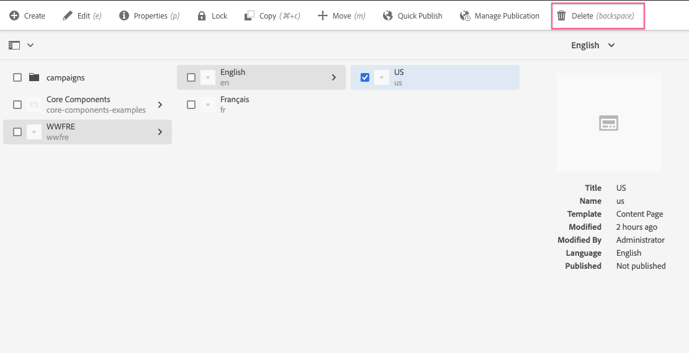
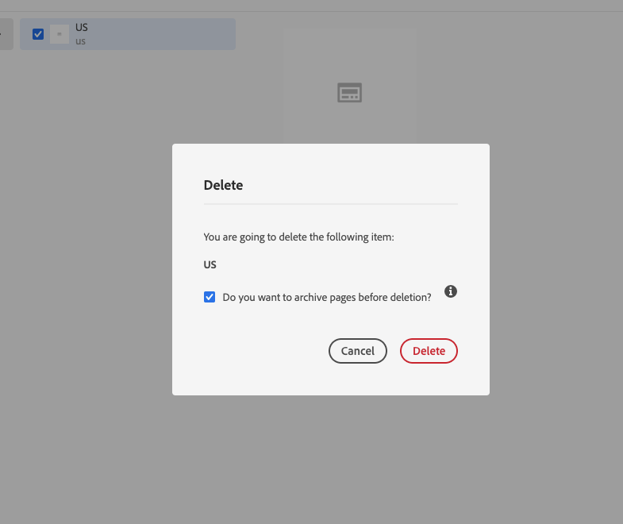

# Optional Versioning on Page Delete.

### Scenario Roadmap

Versioning pages before deletion allows restoring them after deletion. Page versioning can however have a significant performance impact on deletion. Deleting a single page can take up to 0.5-5 seconds as a result.

Page versioning before deletion is now optional. The default behavior is "yes", to ensure consistency with previous behavior.

#### Pre-requisite
You need AEM as a Cloud Service with author tier. 

#### Lesson Context

In this scenario we will understand how pages are archived in AEM Sites.

### Step 1. Initiate a delete operation in AEM Sites

1. In Author Tier, Go to AEM > Sites and verify if you have a sample site present .

 >  * Note :For most training environments, author tier may already have AEM sample site. 
>
  > * Incase you don't see a site deployed in your author tier then you can follow [Scenario 4 - Deploy Custom Project](../04_Deploy_Custom_Project/README.md) and then comeback to this scenario.

   
2. Click checkbox for any sub page in available AEM site.

3. Select **Delete ( or backspace as keyboard shortcut)** from the top menu.

    

4. You should get a pop-up with message **Do you want to archive pages before deletion ?**, Ensure the check-box is checked.

     

5. Click **Delete**
6. Repeat Steps 2 - 5 with **Do you want to archive pages before deletion?** flag unchecked.

    > Note :  Archiving pages here is synonymous with creating versions for respective pages. The info panel further explains what can be achieved with "archiving" pages before deletion, namely being able to restore them later.  

