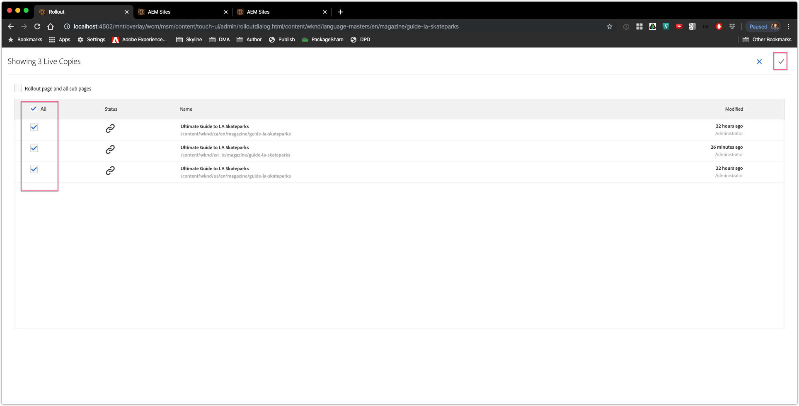

# One to Many Push Rollout Configurations 

### Scenario Roadmap

In AEM 6.5, out of the box, the multi site manager only allowed 1:1 pull rollouts, i.e. the "synchronize" button/option in AEM Live Copy UI. It wasn't possible to initiate rollouts on the live copy source.

In order to allow 1:many push-rollouts, turning a live copy source into a "blueprint" (for many live copies), a "Blueprint Configuration" had to be created (AEM Start/Tools/Sites/Blueprints).

With AEM as a Cloud Service, this would have not been possible as Blueprint Configurations at author runtime are stored under /libs/msm.

In AEM as a Cloud Service, any live copy source is now a "blueprint", meaning the rollout can now be initiated on a live copy source. As soon a live copy is created, the source automatically becomes a "blueprint".

#### Lesson Context

In this scenario, we will create a Livecopy and explore the Blueprint and the Rollout Mechanism.

##### Step 1: Create a Live Copy

1. Navigate to WKND Site > Language Masters > English
2. Select the English (en) site
3. Click ` Create ` > ` Live Copy `
4. Set the destination as ` WKND Site `
5. Click ` Next `
6. Specify the ` Title ` & ` Name `.
7. Leave ` Exlude sub pages ` unchecked
8. Set ` Rollout Configs ` to ` Standard rollout config ` 
9. Click ` Create `

     > 

---

##### Step 2: Rollout

1. Select and Edit a [page](http://localhost:4502/editor.html/content/wknd/language-masters/en/magazine.html) from the blueprint site.
2. Open the ` Page Properties `
3. Goto the ` Blueprint ` Tab
4. Click ` Rollout  ` 
5. Select all Live Copies and Submit

    > 

6. Open the Live Copy Page and Verify the rolled out changes.

---

##### Step 3: Live Copy Overview
 
 1. Select and Edit a [page](http://localhost:4502/editor.html/content/wknd/language-masters/en/magazine.html) from the blueprint site.
2. Open the ` Page Properties ` for the parent page e.g. ` content/wknd/language-masters/en `
3. Goto the ` Blueprint ` Tab
4. Select ` Live Copy Overview `

    >  
    > ` Live Copy Overview ` displays the status of Live Copy status for children blueprint pages 
5. Select a child blueprint page and click ` Rollout `

    > 

6. Select the desired live copy and submit

    > 

----
