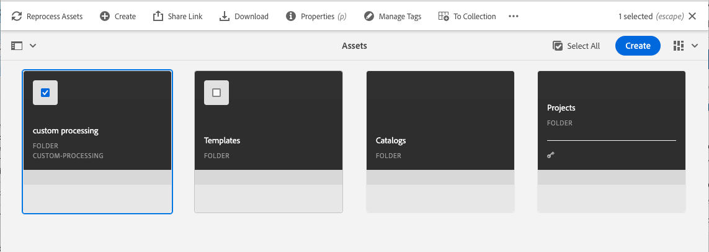

# Asset Micro Service - Processing Profiles and Configuration

### Scenario Roadmap

A processing profile is a recipe for what options to apply to assets that get uploaded to a folder. For example, you can specify what metadata profile and video encoding profile to apply to video assets that you upload. Or, what imaging profile to apply to image assets to have them properly cropped.

Those rules can include adding metadata, smart cropping of images, or establishing video encoding profiles. 

A processing profile can help us define:

> ` Included Mime Types ` - This field supports one or multiple values for mime types which should be processed with the configuration. Java regular expressions, such as "image/.*" can be used to include all image mime types instead of listing all individual mime types

> ` Excluded Mime Types ` - This field supports one or multiple values for mime types which should be processed with the configuration. Java regular expressions, such as "image/.*" can be used to include all image mime types instead of listing all individual mime types

> ` Renditions ` - a list of renditions can be defined per processing profile to define the desired output formats for renditions.  

### Lesson Context

In this scenario, we will define a custom processing profile and apply it to an AEM assets folder.

1. Navigate to Tools > Assets > Processing Profiles

    > 

2. Select the ` Standard ` Profile and ` Copy `

    > 

    > Standard profile is the default processing profile and cannot be edited or deleted. By copying, we creating a replica of this profile for editing.

3. Provide a name for the new profile and click ` Copy `

    > 

4. Select the new custom profile and click ` Edit  `

    > 

    > 

5. Make suitable changes to the profile and ` Save `.
6. Select Profile and use the ` Apply Profile to Folder(s) ` wizard. 

    > 

7.  You can also Assign/Remove Processing Profile to folder via folder properties page, to do so
    > Navigate to the desired folder  
    Select folder and click the "Properties" button in the Action Bar   
     
    Select Processing Profile from "Processing Profiles" tab  
      

8. Upload an asset to the folder.
9. Verify the custom renditions being generated.

