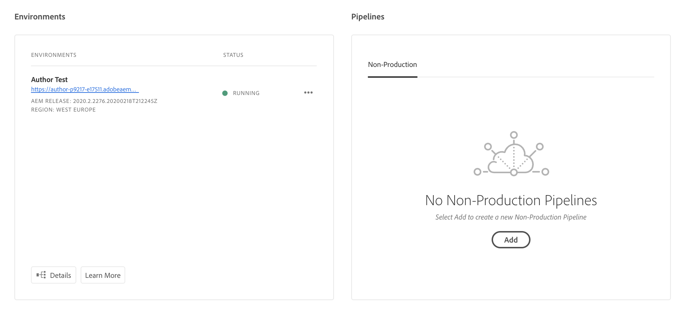
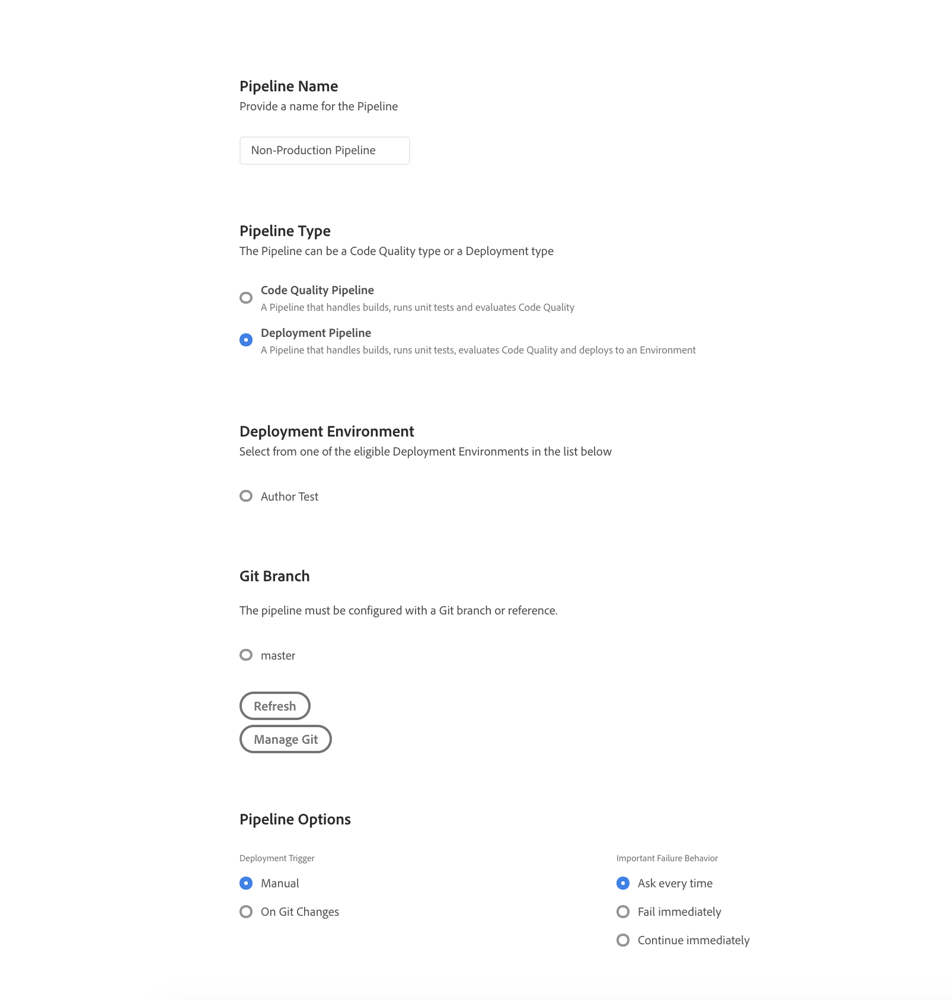
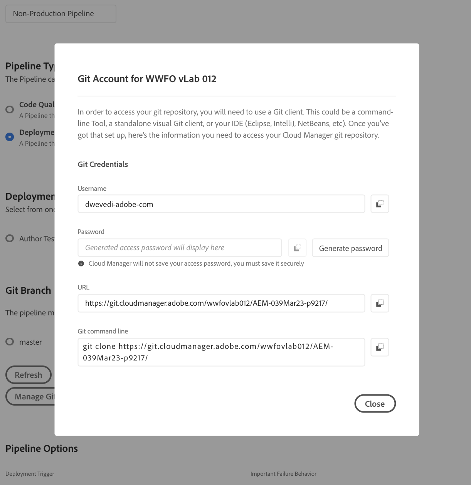

# Deploy Your First Project to AEM Cloud

In this scenario , we will create and deploy our locally generated project to AEM Cloud.

#### Cloud Manager

Cloud Manager is in charge of all orchestrations and deployments to the instances of the AEM Cloud Service.

* It is mandatory, and the only way to build, test and to deploy the customer application both to the Author and the Publish services.


#### Pre-requisites
* A provisioned AEM Cloud Program 
* Access to the Cloud Manager Git Repository

#### Find Git Information.

1. Go to your program in Program Overview of Cloud Manager
2. Check Pipeline Section



3. If you don't have a pipeline , Click Add Button to see Pipeline creation page



3(a). Go to Git Branch section and Click on Manage Git button. Now you should be able to see all details about git.



4. If you have pipeline created , Click on Manage Git Button directly and you should be able to see all required details about git. 


#### Clone Project To Local Development Machine
1.  Clone your project based on  git details you have got in last step. Git clone command should look as following.

```
git clone https://git.cloudmanager.adobe.com/wwXXXXXX/AEM-XXXXX/

```

2. If there is already a sample project - You are good to make changes or delete existing project and create a new one.
3. If there is no project in git master branch. 
4.  Create a new project using the latest Archetype . See [AEM Project Archetype](https://github.com/adobe/aem-project-archetype) for more information.

Alternatively You may run followin command to create project using Archetype 23

```
mvn -B archetype:generate \
  -DarchetypeGroupId=com.adobe.granite.archetypes \
  -DarchetypeArtifactId=aem-project-archetype \
  -DarchetypeVersion=23 \
  -DgroupId="com.adobe" \
  -Dpackage="com.adobe.training"\
  -DappId="training" \
  -DincludeExamples="y" \
  -DappTitle="Training"

```
 5. Add & Push the project to Git Repository ( git commands are for reference only)

```
git add *
git add .gitignore
git commit -m "Training Project "
git push --set-upstream origin master
```

### Step 2. Create a Non-Production Pipeline
1. Go to AEM Cloud Service **Programs** [URL]
2. Go to **Non-Production Pipeline** Card > Click Add 
3. Add Pipeline Name
4. Add **Pipeline Type** as **Code Quality Pipeline**
5. Select master **Git Branch** 
6. Select Pipeline Options **Manual**


### Step 3. Deploy the project
1. Hover over the created pipeline and click **Build**
2. Download and Inspect Logs


### Step 4. Verify Successful Deployment
1. Access Non-Prod Author Environment
2. Go to Sites > Project    
   
