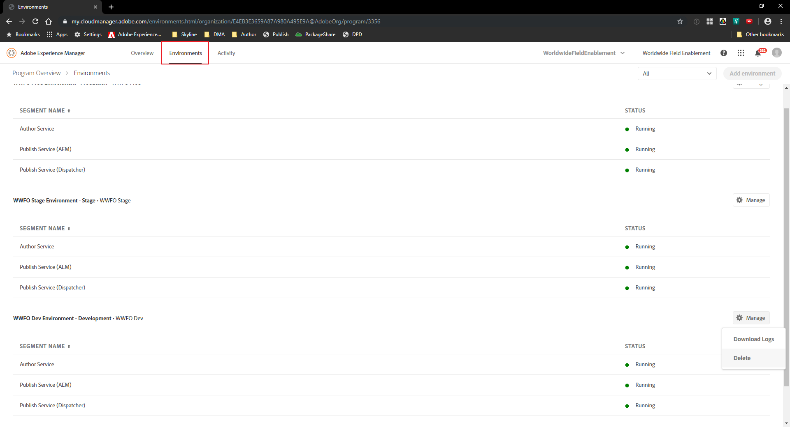
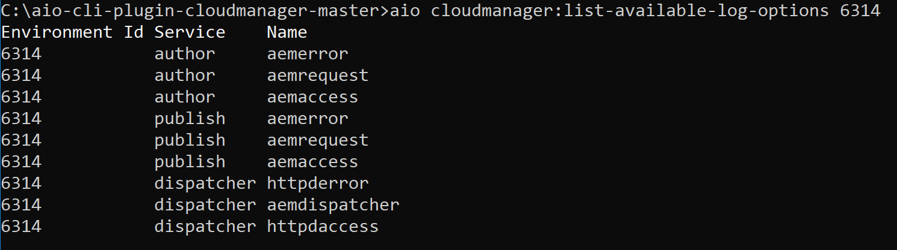

# Access Log files for AEM as a Cloud Service Environment

### Scenario Roadmap

In this scenario, we will use Cloud Manager and the Cloud Manager plugin for the Adobe I/O CLI to access log files for AEM as a Cloud Service Environment.

#### Lesson Context

For this scenario, we will utilize:

* The Adobe I/O CLI tool
* The Cloud Manager UI

```
While the Log Download is available through both the Cloud Manager UI and API, Log Tailing is API/CLI-only
``` 
---

##### Step 1. Access the Logs via the Cloud Manager UI

1. Navigate to Cloud Manager
2. Go to the ` Environments ` Card
3. Click on the setting cog and select ` Download Logs `
    > 
4. Alternatively, click on the ` Environments ` Tab
5. Click ` Manage ` Button and Select ` Download Logs `
    > 

6. Download the log file for the specific environment

    > 

##### Step 2. Access the Logs via Cloud Manager plugin for the Adobe I/O CLI

1. Launch the Command Prompt/Terminal 
2. Navigate to the Adobe IO CLI Plugin Installation Directory (see Scenario 11 for installation)
3. Execute the following commands:
    > Obtain Environment ID: ` aio cloudmanager:list-environments `

    > 

    > View Available Log Options: ` aio cloudmanager:list-available-log-options 6314 `

    > 

    > Download Logs: ` aio cloudmanager:download-logs --programId 3356 6314 author aemerror `

    > Tail Logs: ` aio cloudmanager:tail-log --programId 3356 6314 author aemerror `

