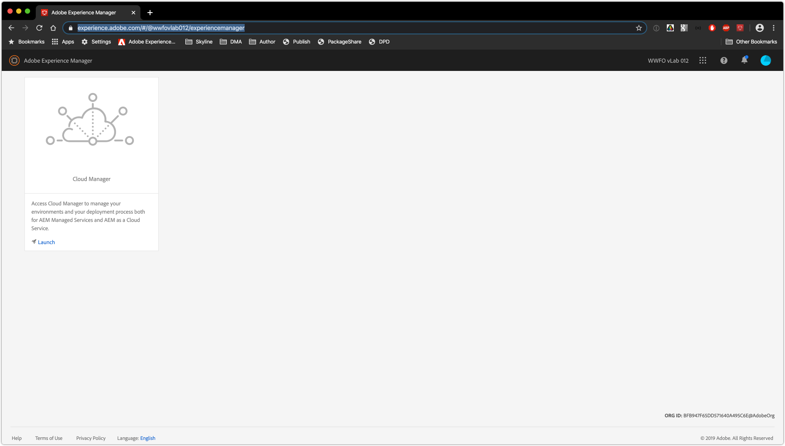
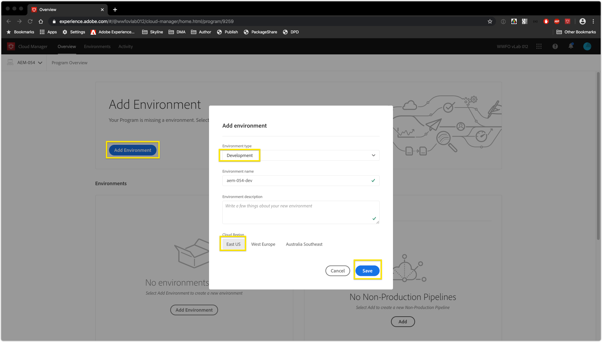
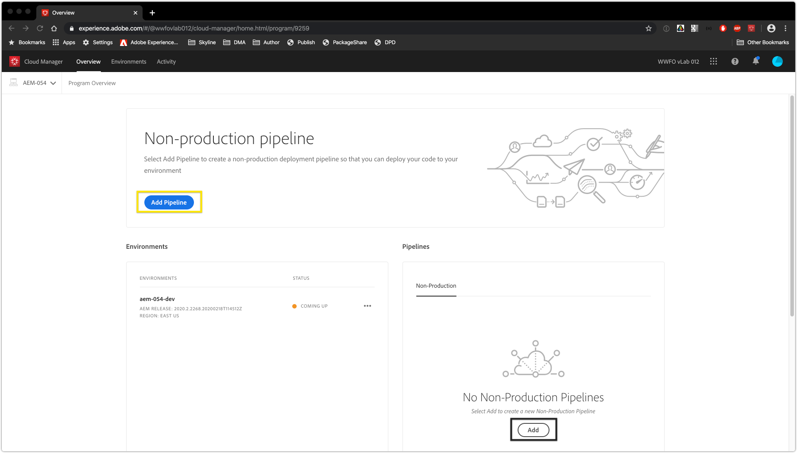
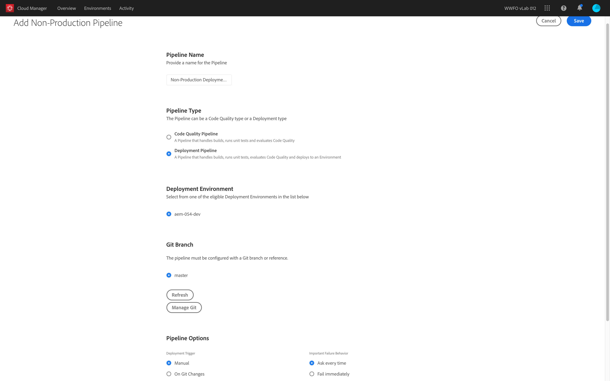

# Solution Access Check
In this scenario , we will verify and setup an AEM as a Cloud Service Environment

#### Cloud Manager

Cloud Manager is in charge of all orchestrations and deployments to the instances of the AEM Cloud Service.

* It is mandatory, and the only way to build, to test and to deploy the customer application both to the Author and the Publish services.


#### Pre-requisites
* A provisioned AEM Cloud Program 


### Step 1. Solution Access Check

1. In an Incongnito Window, navigate to https://experience.adobe.com/#/@wwfovlab012/experiencemanager
2. Click the `Launch` Button
    > 

    > 
3. Select the assigned Cloud Manager Program
    > 
4. Click `Add Environment Button`.
5. Select `Environment type` to `Development` and `Cloud Region` to `East US`
    > 
6. Click `Save`.
7. Wait for the Environment to come up.
8. Click `Add Pipeline` Button.
    > 
9. Set up a Deployment Pipeline and a Non Production Pipeline
    > 

    > ``` In the next exercise we will execute these pipelines for deploying code```

    > ``` As an extra credit, set up a Production + Stage Environment and a Production Pipeline```
