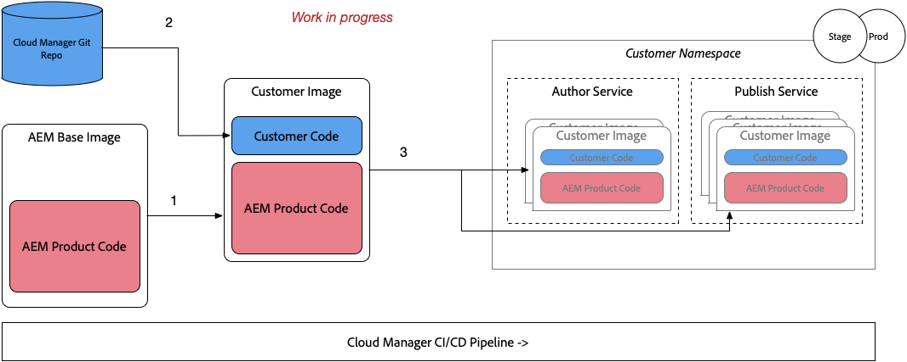
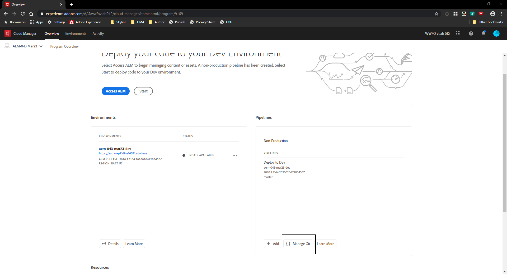

# Deploy Your First Project to AEM Cloud
In this scenario , we will deploy our locally generated project to AEM Cloud.

#### Cloud Manager

Cloud Manager is in charge of all orchestrations and deployments to the instances of the AEM Cloud Service.

* It is mandatory, and the only way to build, to test and to deploy the customer application both to the Author and the Publish services.

#### Pre-requisites
* A provisioned AEM Cloud Program 
* Access to the Cloud Manager Git Repository

#### Pre-requisites Create a Project
1. Create a new project using the latest Archetype or have an existing project

### Step 1. Push your project code to Git Repository

1. Clone [All Demos for AEM as a Cloud Service](https://internal.adobedemo.com/content/demo-hub/en/demos/external/aem-all-demos.html)
    > ` git clone https://git.corp.adobe.com/aem-technical-marketing/com.adobe.aem.demos.all-demos `   
    > ` cd com.adobe.aem.demos.all-demos `

2. Navigate to Cloud Manager Program.
    > 
3. Click on Manage GIT Button
    > 
4. Copy the GIT URL and Password to a text file for later use
    > 
5. Navigate back to Command Prompt and add Cloud Manager GIT Repository as a Remote repository
    > ` git remote add adobe <Cloud Manager Git Url> ` 
6. Verify
    > ` git remote -v `
7. Push changes to Cloud Manager GIT Repository
    > ` git push adobe master:all-demos `
    

    

### Step 2. Create a Non-Production Pipeline
1. Go to AEM Cloud Service **Programs** [URL]
2. Go to **Non-Production Pipeline** Card > Click Add 
3. Add Pipeline Name
4. Add **Pipeline Type** as **Code Quality Pipeline**
5. Select master **Git Branch** 
6. Select Pipeline Options **Manual**

### Step 3. Deploy the project
1. Hover over the created pipeline and click **Build**
2. Download and Inspect Logs

### Step 4. Verify Successful Deployment
1. Access Non-Prod Author Environment
2. Go to Sites > Project    
   
