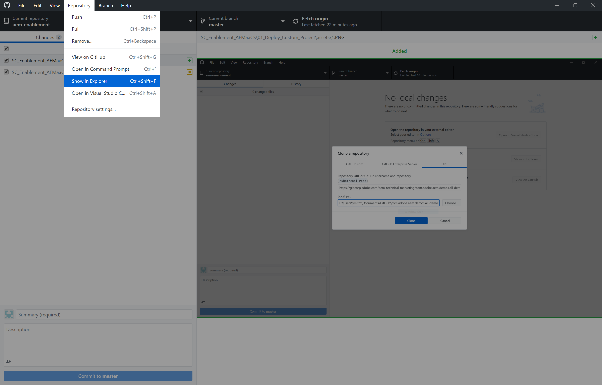
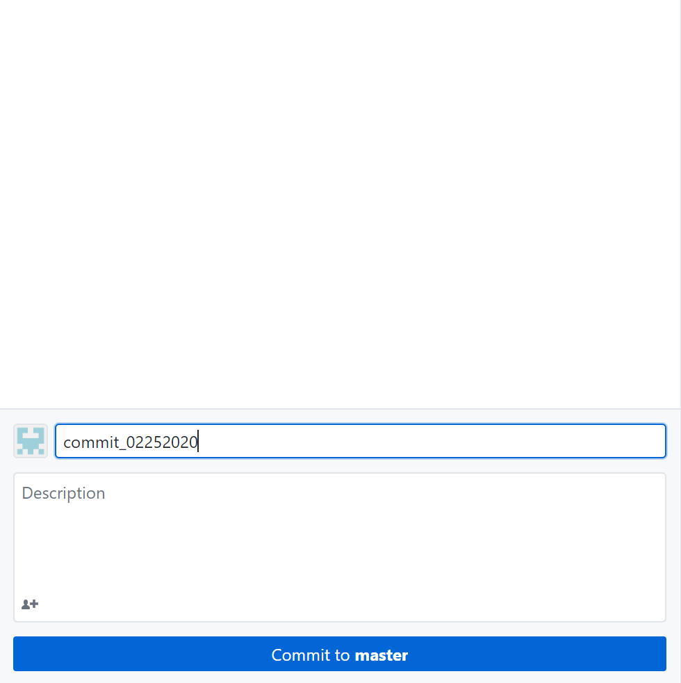

# Deploy Your First Project to AEM Cloud
In this scenario , we will deploy our locally generated project to AEM Cloud.

#### Cloud Manager

Cloud Manager is in charge of all orchestrations and deployments to the instances of the AEM Cloud Service.

* It is mandatory, and the only way to build, to test and to deploy the customer application both to the Author and the Publish services.

#### Pre-requisites
* A provisioned AEM Cloud Program 
* Access to the Cloud Manager Git Repository
* [GitHub Desktop](https://desktop.github.com/)

### Clone All Demo GitHub

1. Launch GitHub Desktop.
2. Go to File > Clone Repository
3. Select the URL tab 
4. Add the following GitHub URL
    > https://git.corp.adobe.com/aem-technical-marketing/com.adobe.aem.demos.all-demos

    > 

5. Clone
6. Click `Fetch Origin`
    > 
7. Go to Repository > Show in Explorer 
    > 
8. Keep the Explorer/Finder Window Open.

#### Clone Cloud Manager GIT Repository
   

1. Navigate to Cloud Manager Program.
    > 
2. Click on Manage GIT Button
    > 
3. Copy the GIT URL and Password to a text file for later use
    > 
5. Navigate back to GitHub Desktop
6. Go to File > Clone Repository
7. Select the URL tab 
8. Add the following Cloud Manager GitHub URL
9. Clone
10. Authenticate using User Id and Password copied from Cloud Manager UI
11. Click `Fetch Origin`
    > 
12. Go to Repository > Show in Explorer
13. Delete all the content except `.git` folder
14. Copy the all the content, excluding `.git` folder from the All Demo's Git Folder
15. Paste the content in the Cloud Manager Git Repository Folder.
16. Provide a commit message and `Commit to Master`
    > 
17. Click `Push to Master`
    >
    

    

### Step 2. Create a Non-Production Pipeline
1. Go to AEM Cloud Service **Programs** [URL]
2. Go to **Non-Production Pipeline** Card > Click Add 
3. Add Pipeline Name
4. Add **Pipeline Type** as **Code Quality Pipeline**
5. Select master **Git Branch** 
6. Select Pipeline Options **Manual**

### Step 3. Deploy the project
1. Hover over the created pipeline and click **Build**
2. Download and Inspect Logs

### Step 4. Verify Successful Deployment
1. Access Non-Prod Author Environment
2. Go to Sites > Project    
   
