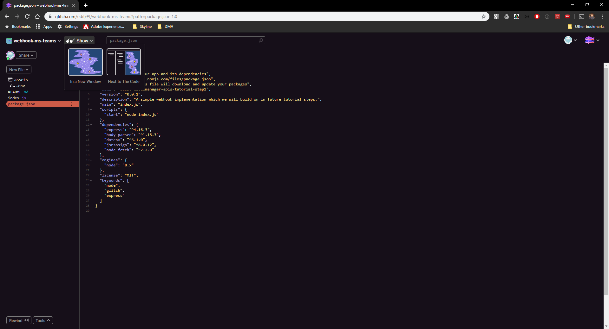
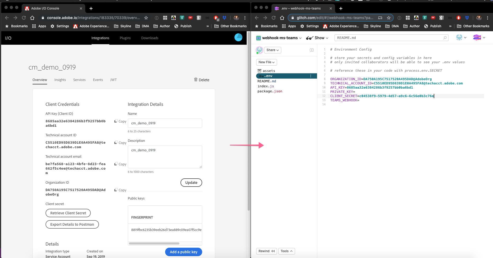
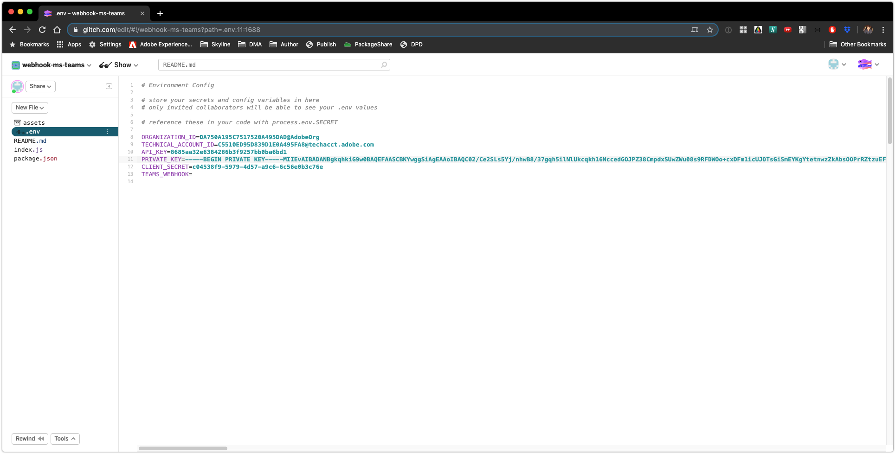
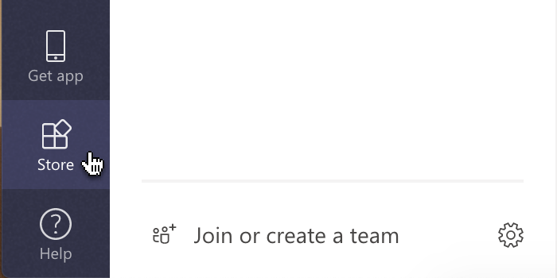
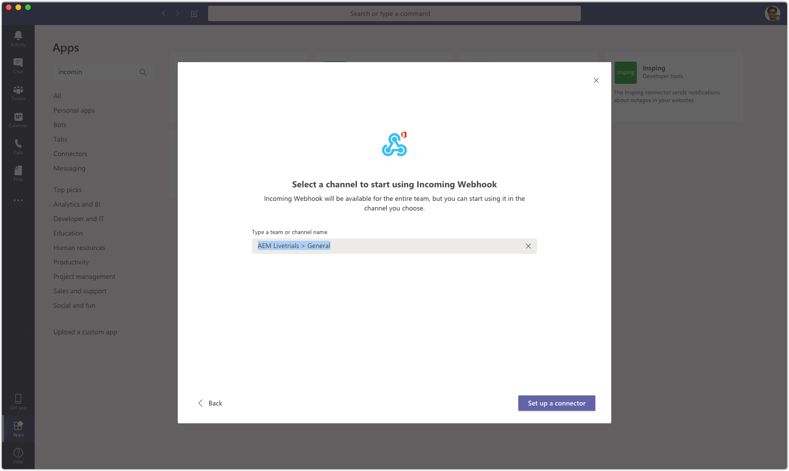

---

# Integrate Cloud Manager with an external system using Adobe I/O.

## Table of Contents

* Lesson 1 - Glitch Setup
* Lesson 2 - Webhook Setup
* Lesson 3 - Testing it Out
* Next Steps

### Scenario Roadmap

In this scenario, we'll be using a number of different tools, so before we get started, let's do a quick overview of what each of these tools does and how we will be using them.

* Cloud Manager
    *  In this scenario, we'll be setting up a CI/CD pipeline in Cloud Manager and executing it a few times. 
*  Git
   * Git is a version control system. Every Cloud Manager customer is provided with a git repository. This scenario won't be teaching you the ins and outs of using git; just enough for you to get by. 
* Adobe I/O
    *  Adobe I/O is Adobe's centralized API Gateway through which customers and partners can integrate with the entire Adobe product portfolio. 
* Microsoft Teams
    * Microsoft Teams is a collaboration platform which includes chat (both group and one-on-one), voice, video, and other types of communication.

### Prerequisites

You will need the following in order to work through this scenario:

* Access to Cloud Manager with the Deployment Manager role.
* The System Administrator role for your Organization in the Adobe Admin Console.
* A git client (either the command line client or as part of an Integrated Development Environment).

## Lesson 1 - Glitch Setup

### Objectives

* Setup a Glitch Account in order to creat a web application

### Lesson Context

### Step 1. Setup a Glitch account 

In this lesson, we will set up a Glitch Account. [Glitch](https://glitch.com/about/) is a simple tool for creating Web Applications

1. Navigate to https://glitch.com/ 
2. Click ` Sign In `

     > 

3. Select an appropriate Sign In option to create an account. For this exercise we are using ` Sign in with GitHub ` option

    > 

### Step 2. Setup a webhook

### Objectives

1. Run a Simple Webhook
2. Expose the Webhook using Glitch

### Lesson Context

In this lesson, you will run a simple web application which illustrates the type of application typically run to receive events from Adobe I/O. You will also use a tool called [Glitch](https://glitch.com/) to deploy and expose the application to the public internet.

1. Click on the below button to setup a webhook within your Glitch Workspace.

  <!-- Remix Button -->

2. The Webhook code should load up in the Glitch IDE, as shown here:
    > 

3. ` .env ` file defines the Environment Configuration i.e. the Client Id, Client Secret, Microsft teams API endpoint etc will be specified here
4. ` index.js ` contains the Webhook code. For more information on creating webhhoks please refer to https://github.com/AdobeDocs/cloudmanager-api-docs/tree/master/tutorial
5. ` package.json ` defines the build profiles and dependencies.
6. To test the Webhook, simply click the ` Show ` button and select ` In a New Window `

    > 

7. You should see an output like this

    > 

8. Copy the Webhook URL from the address bar and using CURL or Postman run: ` run curl -X POST <Webhook URL>/webhook `

     > 

9. You should see ` pong ` as the response.

### Step 3. Setup the Adobe I/O integration

### Lesson Context

We now need to populate the first handful of lines in the ` .env ` file. To do this, we will register an Integration in the Adobe I/O Console. Before doing that, we need to 

1. Run the following command in the Terminal Window or Command Prompt: 
    >   ` openssl req -x509 -sha256 -nodes -days 365 -newkey rsa:2048 -keyout private.key -out certificate.crt `

    > ` This command will generate a cryptographic certificate in order to securely sign requests to Adobe I/O. `

    > ` Retain the private.key and certificate.crt,  these will be used again for Scenario 11   `

    > 

2. Log in to https://console.adobe.io/integrations 
3. Switch to the correct IMS organization
4. Click ` New integration `
    > 

5. Select ` Access an API ` option and click ` Continue `
    > 

6. Select ` Cloud Manager ` and click ` Continue `
  > 

7. Specify:
    * Name
    * Description
    * Public keys certificates: ` Upload certificate.crt `
    * Product Profile: ` AEM Managed Services - Default Profile `
    > 

8. Click on ` Create Integration `.
9. Copy the values from ` Overview ` and Paste into the corresponding field in the ` .env ` file
    * ` API Key (Client ID) ` -> ` API_KEY `
    * `  Organization ID ` -> ` ORGANIZATION_ID `
    * ` Technical account ID ` -> ` TECHNICAL_ACCOUNT_ID `
    * ` Client secret ` -> ` CLIENT_SECRET `
    > 

10. To copy the ` Private Key ` without any line breaks run the following command:

    > ` npm run clean-private-key | pbcopy `

    > Paste the private key into a notepad before specifying the values in ` .env ` file
11. ` .env ` file would look something like
    > 

12. Navigate back to Adobe IO Console
13. Click ` Events ` Tab, Select ` Cloud Manager ` and Click ` Add Event Provider  `

     > 

14. Click  ` Add Event Registration ` 
     > 
 
15. Set
    * Event Registration Name
    * Webhook URL ( optional ): ` <Webhook URL>/webhook `
    * Event Description
    * Select ` Pipeline Execution Started `
    * Event Delivery Method : ` One at a time `

    > 

16. ` Save `. Webhook should get registered.

    > 

### Step 4. Setup Microsoft Teams

1. Download and Install [Microsoft Teams](https://products.office.com/en-us/microsoft-teams/download-app#desktopAppDownloadregion)
2. Join [AEM Event](https://teams.microsoft.com/l/channel/19%3a5b863af592054aeeb1a626312d632c92%40thread.skype/General?groupId=c439f143-e41d-4170-bb84-ee0a79a7e846&tenantId=fa7b1b5a-7b34-4387-94ae-d2c178decee1) Team
3. To create an Incoming Webhook integration, click the Store icon.
    > 

4. Search for _incoming_ and click on _Incoming Webhook_.

    >  

5. Select ` AEM Event > General ` as the team. Since the connector is already installed, click the _Available_ link.

    > 

6. The webhook should send messages to the General channel by default. On the next screen, click _Set up_.

7. You need to provide a name for your webhook. Do this with a name based on your attendee number and click the _Create_ button.

    > 

8. You will now see a URL (it will begin with `https://outlook.office.com/webhook/`). Click the button to copy this to the clipboard and click the _Done_ button.

    > 

9. Now switch back to `Glitch` and paste the copied URL as the value of the `TEAMS_WEBHOOK` variable in the _.env_ file.

    > 

## Testing and Validation

Go back to Cloud Manager and Execute the pipeline. You should see a message like ` Update from Cloud Manager Execution for We.Retail Assets started `, in Microsoft Teams.

> 
