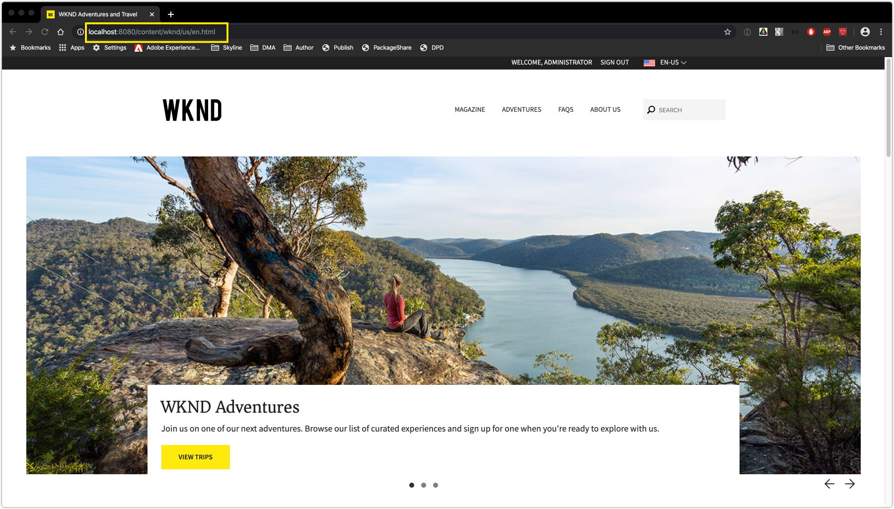

# Using the Dispatcher Configuration Validator

## Table of Contents

  
  - [Table of Contents](#table-of-contents)
  - [Scenario Overview](#scenario-overview)
  - [Key Takeaways](#key-takeaways)
 - [Pre-requisites](#pre-requisites)
 
  - Lesson 1 - Setting up Docker
  - Lesson 2 - Setup Dispatcher SDK Validator
  - Lesson 3 - Run Dispatcher SDK Validator
  - Lesson 4 -  Run the Dispatcher SDK using Docker


## Scenario Overview

Checking in a dispatcher configuration that is invalid will interrupt the Cloud Manager pipeline. It is important to validate the code locally before checking in. Adobe has provided developers the Dispatcher SDK Validator for validating these configurations locally.

The Dispatcher SDK provides:

* Dispatcher Configuration : a vanilla file structure containing the configuration files to include in a maven project for the dispatcher
* Dispatcher Validator: tooling for customers to validate a dispatcher configuration locally
* Dispatcher Docker Image: a Docker image that brings up the dispatcher locally

The validation tool is available in the SDK as a macOS or Linux binary.

It allows customers to run the same validation that Cloud Manager will perform while building and deploying a release.

### Key Takeaways

* Setup Dispatcher SDK Validator on your local machine
* Use the Dispatcher SDK Validator to validate dispatcher Configureations


### Pre-requisites

* AEM Project with Dispatcher Configurations

### Step 1. Setting up Docker locally

1. Navigate to (Docker Hub)[https://hub.docker.com/signup] and Sign up for a Docker ID
2. Download and Install [Docker for Mac](https://download.docker.com/mac/stable/Docker.dmg) or for [Windows](https://download.docker.com/win/stable/Docker%20Desktop%20Installer.exe)
3. Sign in to your Local Docker Instance.

### Step 2. Setup the Dispatcher SDK Validator

1. Unzip the downloaded aem-sdk-XXX.zip file
2. Unpack the Dispatcher Tools into ~/aem-sdk/dispatcher
    > ` Windows `: Unzip aem-sdk-dispatcher-tools-2.0.20-windows.zip into C:\Users\<My User>\aem-sdk\dispatcher (creating missing folders as needed) <br><br>

    > ` macOS `: Execute the accompanying shell script aem-sdk-dispatcher-tools-2.0.20-unix.sh to unpack the Dispatcher Tools
    
     > ``` chmod a+x aem-sdk-dispatcher-tools-2.0.20-unix.sh && ./aem-sdk-dispatcher-tools-2.0.20-unix.sh ```


### Step 3. Run Dispatcher SDK Validator
1. Navigate to the ` dispatcher-sdk-2.0.20 ` folder
2. Run the following commands: <br>
`For Windows`<br>
    > `bin\validator full -d out src` <br>

    `For Mac`<br>
    > `./bin/validator full -d ./out ./src`
---
> The validation is dual purpose:<br>

>    `Validates the Apache HTTP Web server and Dispatcher configuration files for correctness.`<br>

>    `Transpiles the configurations into a file-set compatible with the Docker container's Apache HTTP Web Server.`

### Step 4. Run the Dispatcher SDK using Docker

> `Once validated, the transpiled configurations are used run Dispatcher locally in the Docker container. It is important to ensure the latest configurations have been validated and output using the validator's -d option.`


1. Start AEM Publish server on Port 4503.
2. Run the following commands: <br>
`For Windows`<br>
    > `bin\docker_run out host.docker.internal:4503 8080` <br>

    `For Mac`<br>
    > `./bin/docker_run.sh ./out docker.for.mac.localhost:4503 8080`

3. This should start the Apache Server on Port 8080. Command Line output should look something like:
    > 

4. In the browser window, navigate to http://localhost:8080
    > 