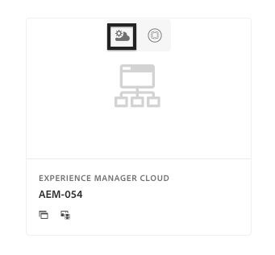
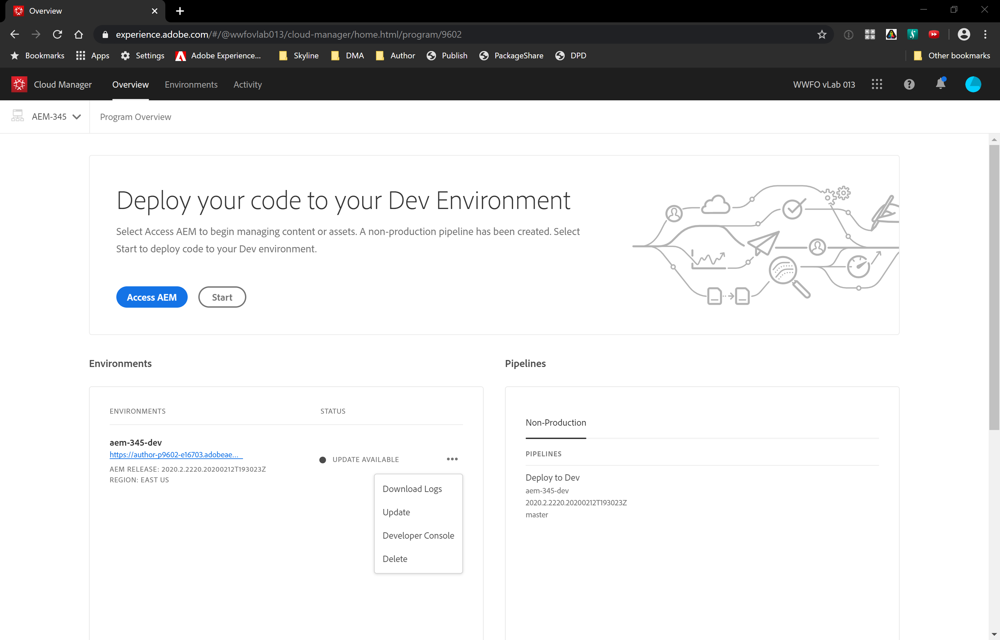

# Solution Access Check
In this scenario , we will verify and setup an AEM as a Cloud Service Environment

#### Cloud Manager

Cloud Manager is in charge of all orchestrations and deployments to the instances of the AEM Cloud Service.

* It is mandatory, and the only way to build, to test and to deploy the customer application both to the Author and the Publish services.

#### Pre-requisites
* A provisioned AEM Cloud Program 

### Step 1. Solution Access Check

1. In an Incongnito Window, navigate to https://experience.adobe.com/#/@wwfovlab013/experiencemanager 
2. Login using the Credentials provided in [Google Sheet](https://docs.google.com/spreadsheets/d/1_NlukckAvLPJ-v3HB6-YOFEueT-NWdXz5AEUwLvXeAc/edit?usp=sharing)
3. Click the `Launch` Button
    > 

    > 
4. Select the assigned Cloud Manager Program
    > 
5. Verify the Program Details 

    * Click on `aem-xxx-dev` environment URL and verify access to AEM Author Server
    * Click on `Deploy to Dev` Pipeline and verify the Deployment Environment.
6. Click the `Details` Button in the Environment Card or goto the `Environment` Tab
    > 
7. You can request a new environment by clicking `Add Environment Button`.
8. Click ` Activity ` Tab and verify the status for previous pipeline executions.
9. Go back to the ` Overview ` Tab
10. In the `Environments` card, verify if the new update is available for Cloud Services.
    > 

    > ` In the next exercise we will execute Deployment pipelines for deploying code and updating our Instance `