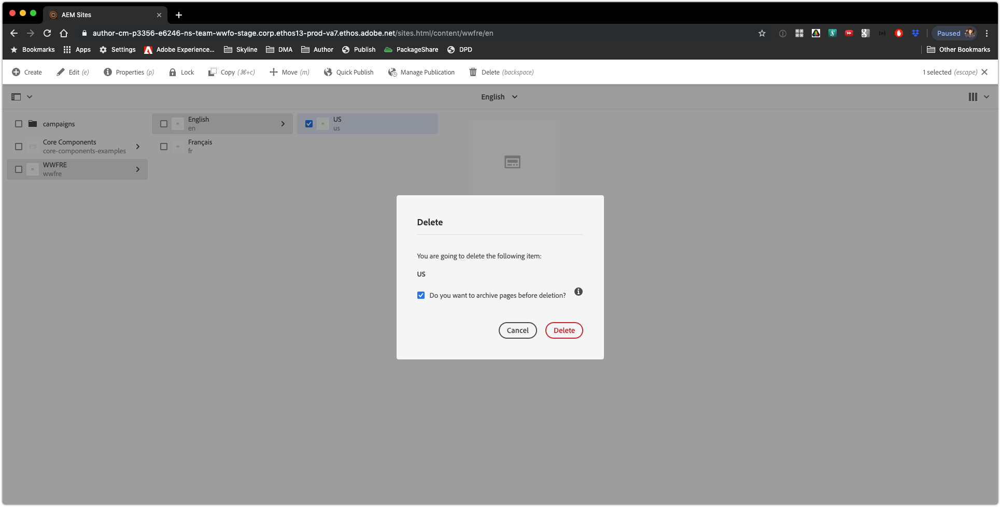

# Optional Versioning on Page Deletion

### Scenario Roadmap

Versioning pages before deletion allows the ability to restorce versioned pages after deletion. However, page versioning can however have a significant performance impact on deletion. Deleting a single page can take up to 0.5-5 seconds as a result.

Page versioning before deletion is now optional. The default behavior is "yes", to ensure consistency with previous behavior.

#### Lesson Context

In this scenario, you will learn how pages are archived in AEM Sites 

### Step 1. Initiate a delete operation in AEM Sites

1. Select the (checked selection) sub-page in AEM Sites.

2. Click ` Delete (Backspace) ` on the actions bar, as shown.

    > 

3. Verify ` Do you want to archive pages before deletion? ` is checked.

    > 

4. When the **Delete** dialog displays, click ` Delete `
*Warning*! You cannot undo this action. Once you click the Delete button, the subpage is deleted. 

5. Repeat Steps 1 through 3 with the ` Do you want to archive pages before deletion? ` checkbox unchecked.

    > ` Archiving pages here is equivalent to creating multiple versions for respective pages. The info panel further explains what can be achieved with "archiving" pages before deletion, which allows you to restorce the pages later.  `

