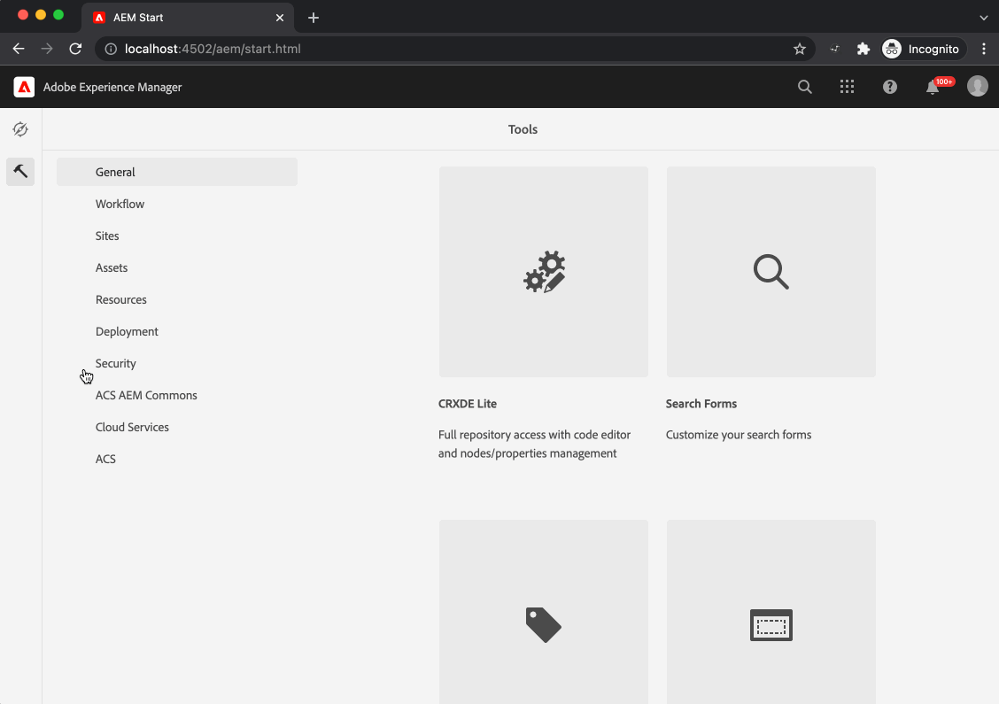

# Fastly Purge AEM Console

*Fastly Cache Purge Console complete with services/servlets and distribution handler.*

   
  
   

## More

This is a simple console to purge cache from fastly. It was built for use with cloud service but you can certainly deploy it anywhere.

This package also include a distribution listener to purge cache on distribution events for Cloud Service.

This tool useus the little known public purge API:
https://developer.fastly.com/reference/api/purging

See the `PURGE` method endpoint.

~~In cloud service, as of this writing, this API requires no authentication. That might change in future, but for now, this tool useus it.~~
Currently, the API requires a header to be sent, `x-aem-purge-key` with the value being the purge key.
A Customer can reach out to support to get that key.

That's also documented here:

https://git.corp.adobe.com/pages/experience-platform/skyline-runbooks/howto/CdnInvalidation.html#how-to-invalidate-a-single-resource

This tool does a hard purge.

## Configuration
This tool can be configured via the following [Cloud Manager Environment Variables and Secrets](https://experienceleague.adobe.com/docs/experience-manager-cloud-service/content/implementing/using-cloud-manager/environment-variables.html?lang=en):

### `FASTLY_HOST`
Environment variable
The Cloud Service Environment Publish Host (Fastly) including scheme (http:// or https://)

### `FASTLY_PURGE_KEY`
Environment **Secret**
The Purge Key to use (Reach out to Adobe Support to get this key, it is environment specific.)

## PURGE API Limitations
Can only purge one path from fastly at a time. No wild cards or anything else, just one path per PURGE request.

## How to build

To build all the modules run in the project root directory the following command with Maven 3:

    mvn clean install

To build all the modules and deploy the `all` package to a local instance of AEM, run in the project root directory the following command:

    mvn clean install -PautoInstallSinglePackage

Or to deploy it to a publish instance, run

    mvn clean install -PautoInstallSinglePackagePublish

Or alternatively

    mvn clean install -PautoInstallSinglePackage -Daem.port=4503

Or to deploy only the bundle to the author, run

    mvn clean install -PautoInstallBundle

Or to deploy only a single content package, run in the sub-module directory (i.e `ui.apps`)

    mvn clean install -PautoInstallPackage